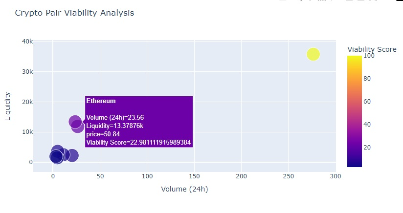

# EmptyMyWallet 💸

A machine learning-powered DeFi trading bot that analyzes DexScreener data, detects opportunities, and executes secure trades on Binance. It includes anti-scam protection with RugCheck and real-time liquidity analysis.

⚠️ **Disclaimer**: This project is for educational purposes and does not constitute financial advice. Only invest what you can afford to lose. It is recommended to run it only in "Test" mode or on a dedicated Binance account.

## 🚨 Project Status: Development



This project is currently under active development and **not production-ready**. We welcome contributors to help improve the following areas:

### Critical Issues to Resolve

1. **API Integrations**
   - RugCheck API integration not functional
   - Honeypot API needs chain support revision
   - Blockchain explorer API calls need robust error handling

2. **Machine Learning**
   - Isolation Forest model needs optimization
   - Feature engineering required
   - Model persistence not implemented
   - Performance metrics missing

3. **Trading Security**
   - Slippage management missing
   - No stop-loss/take-profit
   - Price validation needed
   - Rate limiting required

### Planned Features

1. **High Priority**
   - [ ] Unit tests and integration tests
   - [ ] Trading security improvements
   - [ ] API integration fixes
   - [ ] ML model optimization

2. **Medium Priority**
   - [ ] User interface for monitoring
   - [ ] Telegram/Discord notifications
   - [ ] Docker containerization
   - [ ] Performance monitoring

3. **Low Priority**
   - [ ] Multi-portfolio support
   - [ ] Automated reporting
   - [ ] Internationalization
   - [ ] Performance optimizations

## 🚀 Key Features (In Development)

- **🕵️ Advanced On-Chain Analysis**
  - DexScreener pair data retrieval
  - Contract creator detection via Etherscan/BscScan
  - RugCheck.xyz reputation verification
  - Bundled Supply detection

- **🤖 Artificial Intelligence**
  - Anomaly detection with Isolation Forest
  - Model trained on 100,000 historical data points
  - Multivariate analysis (price, liquidity, volume)

- **🔒 Enhanced Security**
  - Double blacklist (token + developer)
  - Dynamic honeypot filters
  - Risk-free test mode with Binance Testnet

## 📋 Prerequisites

- Python 3.10+
- Binance Account [Get Here](https://www.binance.com/)
- API Keys:
  - Binance (Production and TestNet)
  - Etherscan ([Get Here](https://etherscan.io/apis))
  - BscScan ([Get Here](https://bscscan.com/apis))
  - Polygon ([Get Here](https://polygonscan.com/apis))

## 🛠️ Installation

1. **Clone the repository**
```bash
git clone https://github.com/yourusername/empty-my-wallet-bot.git
cd empty-my-wallet-bot
```

2. **Set up environment**
```bash
python -m venv venv
source venv/bin/activate  # Linux/Mac
venv\Scripts\activate     # Windows
```

3. **Install dependencies**
```bash
pip install -r requirements.txt
```

4. **Configure environment variables (.env)**
```ini
# Binance
BINANCE_API_KEY="your_production_key"
BINANCE_API_SECRET="your_production_secret"

# Database
POSTGRES_HOST="your-host.com"
POSTGRES_PORT=12345
POSTGRES_DB="defaultdb"
POSTGRES_USER="admin"
POSTGRES_PASSWORD="your-password"

# Explorers
ETHERSCAN_API="your_etherscan_key"
BSCSCAN_API="your_bscscan_key"
POLYGON_API="your_polygon_key"

TEST_MODE="true"  # Test mode (For tracking without real trades)
```

### **Configuration ⚙️**

#### **`config/config.yaml`**
```yaml
FILTERS:
  min_liquidity: 10000    # Minimum liquidity in USD
  max_age_days: 7         # Maximum pair age
  chain_whitelist:        # Monitored blockchains
    - "ethereum"
    - "bsc"
    - "polygon"

RISK_MANAGEMENT:
  max_trade_size: 100     # USD per trade
  daily_loss_limit: 500   # Maximum daily loss in USD
  slippage_tolerance: 1.5 # Accepted slippage percentage

ANALYSIS:
  model_refresh: 3600     # Retraining interval (seconds)
  anomaly_threshold: -0.7 # Anomaly detection threshold
```

### **Usage 🚦**

#### **Run in Production Mode**
```bash
python main.py
```

#### **Optional Commands**
```bash
--interval 300       # Runs analysis every 5 minutes
--liquidity 5000     # Adjusts minimum liquidity
--chains eth,bsc     # Filters blockchains
```

### **Project Structure 📂**
```
empty-my-wallet-bot/
├── main.py                 # Main entry point
├── config/
│   ├── __init__.py
│   ├── config.py           # Configuration management
├── log/
│   └── dex_screener_bot.log # Backend log
│   └── logging_config.py   # Logging configuration
├── db/
│   └── db.py               # PostgreSQL interactions
├── empty_my_wallet/
│   └── empty_my_wallet.py  # Where the magic happens
├── utils/
│   ├── security.py         # Filters and blacklists (TODO)
│   └── analytics.py        # AI models (TODO)
├── frontend/
│   └── front.py            # Displays DB indicators
├── .env.example            # Template for .env files
├── requirements.txt        # Lists all dependencies
```

### **Analysis Workflow 🔄**
1. Retrieve pairs from DexScreener  
2. Validate addresses and clean data  
3. Check blacklists (on-chain & local)  
4. Detect anomalies using Isolation Forest  
5. Execute trades on Binance (if conditions met)  
6. Update database and blacklists  

## 🤝 Contributing

We welcome contributions! Please see our [Contributing Guide](CONTRIBUTING.md) for details. Here's how to get started:

1. Fork the project
2. Create your feature branch (`git checkout -b feature/amazing-feature`)
3. Commit your changes (`git commit -m 'Add amazing feature'`)
4. Push to the branch (`git push origin feature/amazing-feature`)
5. Open a Pull Request

### Before Contributing

1. Check the [Issues](https://github.com/yourusername/empty-my-wallet-bot/issues) page for current tasks
2. Read our [Code of Conduct](CODE_OF_CONDUCT.md)
3. Review the [Project Architecture](docs/ARCHITECTURE.md)
4. Set up the [Development Environment](docs/DEVELOPMENT.md)

## 📄 License

Distributed under the MIT License. See `LICENSE` for more information.

---

**Developed by [Nathan RIHET](https://www.linkedin.com/in/nathan-rihet/) | Only invest what you can afford to lose!**
